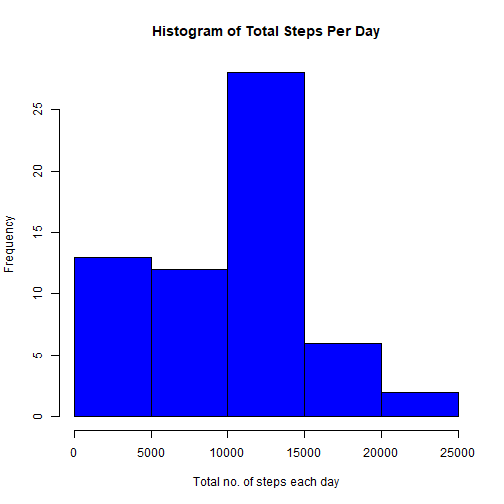
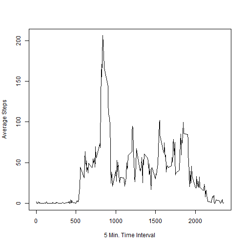
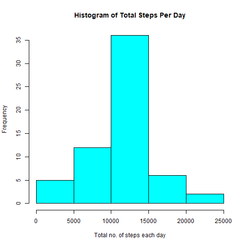
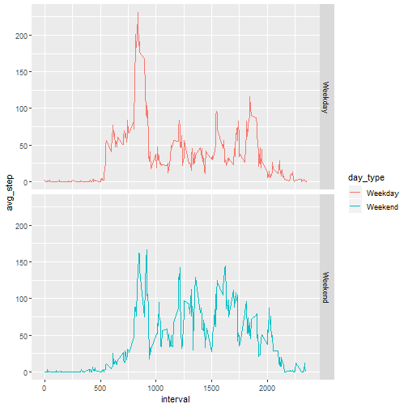

## Course Project 1
This assignment makes use of data from a personal activity monitoring device. This device collects data at 5 minute intervals through out the day. The data consists of two months of data collected during the months of October and November, 2012 and include the number of steps taken in 5 minute intervals each day.

The purpose of this project to analyse given data and write a redprocudible research document using 'knitr. The data for this assignment can be downloaded from the course web site https://d396qusza40orc.cloudfront.net/repdata%2Fdata%2Factivity.zip


####Load packages  


```r
library(dplyr)
```

```
## 
## Attaching package: 'dplyr'
```

```
## The following objects are masked from 'package:stats':
## 
##     filter, lag
```

```
## The following objects are masked from 'package:base':
## 
##     intersect, setdiff, setequal, union
```

```r
library(ggplot2)
```

####Downloading and unzipping raw data from the given URL 


```r
if(!file.exists("./Data")) {dir.create("./Data")}
fileurl <- "https://d396qusza40orc.cloudfront.net/repdata%2Fdata%2Factivity.zip"

if(!file.exists("./Data/repdata_data_activity.ZIP"))
     {
          download.file(fileurl,"./Data/repdata_data_activity.ZIP")
          unzip("./Data/repdata_data_activity.ZIP",exdir = "./Data", unzip = "internal",setTimes = FALSE)
     }
```

####Load the data


```r
data <- read.csv(file = "./Data/activity.csv",header = TRUE)
```

####Compute total, mean and median of steps taken each day


```r
 total_steps_datewise <- data %>%
                         group_by(date) %>%
                         summarise(total_step = sum(steps, na.rm = TRUE))

 avg <- as.integer(mean(total_steps_datewise$total_step))
 
 median <- median(total_steps_datewise$total_step)
```

####Create Histogram


```r
 hist(total_steps_datewise$total_step, xlab = "Total no. of steps each day", col = "Blue", main = "Histogram of Total Steps Per Day")
```



The average of the total number of steps taken each day is 9354. The median value is 10395.  

####Compute average no. of steps interval wise


```r
 avg_steps_intervalwise <- data %>%
                           group_by(interval) %>%
                           summarise(avg_step = mean(steps, na.rm = TRUE))

 max <- avg_steps_intervalwise[which.max(avg_steps_intervalwise$avg_step),]
```

####Time series plot of the average number of steps taken


```r
 with(avg_steps_intervalwise, plot(interval, avg_step, xlab = "5 Min. Time Interval", ylab = "Average Steps", type = "l"))
```



Time interval number 835 has highest number of average steps for all days.

####Calculate and report the total number of missing values in the dataset (i.e. the total number of rows with NAs)


```r
 count_of_NA <- sum(is.na(data$steps))
```

The total number of missing values in the dataset (i.e. the total number of rows with NAs) is 2304.

####Creating  a revised dataframe by replacing NA values in 'steps' with the mean values of the steps taken for the corresponding interval.


```r
 df <- data %>% mutate(steps_new = replace(steps,which(is.na(steps) & interval == avg_steps_intervalwise$interval),avg_steps_intervalwise$avg_step))

 data_new <- select(df, steps = steps_new, date, interval)
```

####Calculate total steps, mean and median values for revised data.  


```r
 datewise_new  <- data_new %>%
                 group_by(date) %>%
                 summarise(total_step = sum(steps))

 avg_new <- as.integer(mean(datewise_new$total_step))
 
 median_new <- as.integer(median(datewise_new$total_step))
```

####Create revised histogram of new data


```r
hist(datewise_new$total_step, xlab = "Total no. of steps each day", col = "Cyan", main = "Histogram of Total Steps Per Day")
```



The average of the total number of steps taken each day is 10766. The median value is 10766. 


With the updated dataset as done in the above steps, Make a panel plot containing a time series plot of the 5-minute interval (x-axis) and the average number of steps taken, averaged across all weekday days or weekend days (y-axis) as given below.

####Re-compute the average number of steps for each interval using revised data (data_new) and then use ggplot for the plot.


```r
 data_new <- mutate(data_new, day = weekdays(as.Date(date)), day_type = as.factor(if_else(day == "Saturday" | day == "Sunday", "Weekend","Weekday")))

 avg_data_new <- data_new %>% 
                 group_by(interval,day_type) %>% 
                 summarise(avg_step = mean(steps))
```

####Panel Plot


```r
 g <- ggplot(avg_data_new, aes(interval, avg_step, colour = day_type))
 g <- g + geom_line() + facet_grid( rows = vars(avg_data_new$day_type))

 print(g)
```


